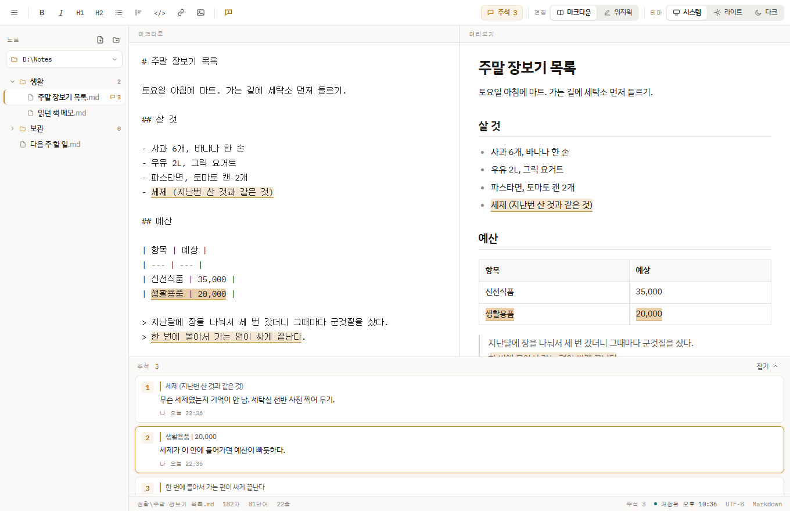
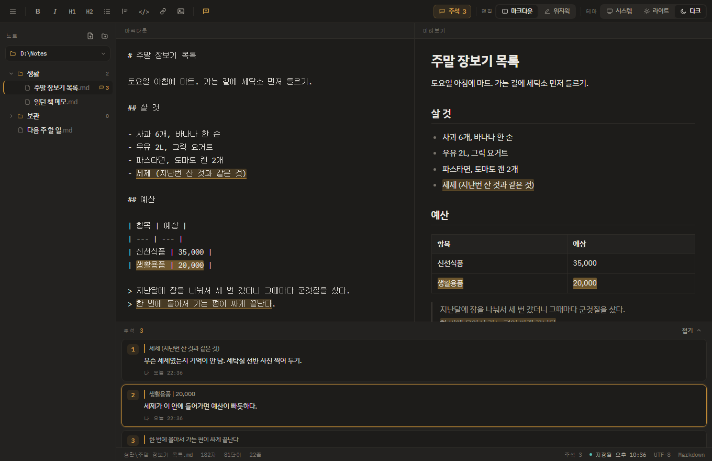
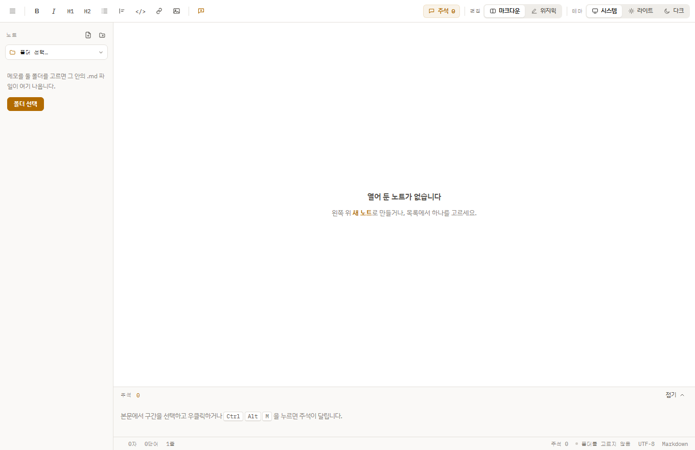

<div align="center">


# Comment Note

**본문을 고치지 않고, 본문에 말을 붙여 두는 메모장**

[](LICENSE)


</div>

<br>

메모장에 뭔가를 쓰다 보면 이런 줄이 섞인다. `(← 이거 나중에 고치기)` `※ 근거 약함` `TODO`.
며칠 뒤에 열어 보면 본문인지 나에게 남긴 말인지 구분이 안 된다.

**Comment Note는 그 말을 본문에서 떼어 낸다.** 구간을 선택하고 우클릭해 주석을 달면,
본문은 그대로 있고 그 구간에 표시가 남는다. 마우스를 올리면 주석이 뜨고, 하단 목록에 문서 순서대로 쌓인다.

<br>



<details>
<summary>다크 모드 · 처음 실행한 화면</summary>




</details>

<br>

## 주석

이 앱의 전부다. 나머지 기능은 이걸 받쳐 주기 위해 있다.

- **문자 단위로 붙는다** — 줄 단위가 아니라 문장 중간의 다섯 글자에도 달린다.
- **어느 화면에서 봐도 같은 구간** — 주석은 마크다운 원문의 문자 오프셋 `[start, end)` 으로 저장된다.
  마크다운 원문·미리보기·위지윅 세 화면이 같은 오프셋을 그리므로, 어디서 달아도 어디서나 같은 자리에 보인다.
  `**굵게**` 표시를 가로지르는 구간, 여러 줄에 걸친 구간, 표의 여러 셀에 걸친 구간도 어긋나지 않는다.
- **본문을 건드리지 않는다** — 주석을 달고 지워도 본문 글자는 하나도 바뀌지 않는다.
- **사라진 구간은 숨기지 않는다** — 주석이 가리키던 문장을 지우면 조용히 버리지 않고
  "본문에서 사라진 구간"으로 남겨 둔다. 지울지 옮길지는 사람이 정한다.

## 그 밖에

| | |
|---|---|
| **편집 방식 두 개** | 마크다운 원문 + 실시간 미리보기 / 위지윅. 두 방식은 서로 되돌아온다 (위지윅에서 고친 내용과 새로 단 주석이 마크다운 원문에 그대로 남는다) |
| **저장 위치를 고른다** | 폴더 하나를 열고 그 안의 `.md` 파일을 그대로 다룬다. 앱 전용 데이터베이스는 없다. 처음 실행하면 아무 폴더도 열려 있지 않다 |
| **폴더 트리** | 고른 폴더의 구조를 그대로 보여준다. 파일마다 주석 개수가 붙는다 |
| **파일 다루기** | 새 노트 · 새 폴더는 왼쪽 위 버튼. 파일이나 폴더를 우클릭하면 이름 바꾸기, 삭제, 탐색기에서 보기, 경로 복사 |
| **삭제는 휴지통으로** | 완전 삭제하지 않는다. 잘못 지워도 되돌릴 수 있다 |
| **자동 저장** | 편집이 멈추면 0.7초 뒤에 파일에 쓴다. `Ctrl+S` 는 즉시 |
| **이미지** | 붙여넣기(`Ctrl+V`), 드래그 앤 드롭 |
| **테마** | 라이트 / 다크 / 시스템 |

### 단축키

| 동작 | 키 |
|---|---|
| 주석 달기 | `Ctrl+Alt+M` |
| 편집 방식 전환 | `Ctrl+Alt+P` |
| 테마 전환 | `Ctrl+Alt+T` |
| 폴더 트리 접기 | `Ctrl+Alt+B` |
| 새 노트 | `Ctrl+N` |
| 저장 위치 바꾸기 | `Ctrl+Shift+O` |
| 저장 | `Ctrl+S` |

<br>

## 지금 상태

UI 와 주석 엔진은 브라우저 헤드리스 테스트 44개로 검증했다.
파일 시스템 쪽은 CI 에서 컴파일까지 확인했고, 사람이 실제로 눌러 본 검증은 아직 없다.

- [x] 주석 엔진 — 문자 오프셋 기반, 세 화면 동기화, 고아 주석 처리
- [x] 마크다운 렌더러 (제목·목록·표·인용·코드펜스·이미지·링크)
- [x] 마크다운 ↔ 위지윅 왕복
- [x] 폴더 열기 · 폴더 트리 · 자동 저장
- [x] 새 노트 / 새 폴더 / 이름 바꾸기 / 삭제(휴지통) / 탐색기에서 보기
- [x] 라이트 / 다크 / 시스템 테마
- [ ] **실기 확인** — 폴더를 열고 저장·삭제까지 사람이 눌러 보는 검증
- [ ] 주석을 파일에 저장 — 아래 설계 확정 필요. 지금은 주석이 앱을 닫으면 사라진다
- [ ] 파일 감시 (외부에서 파일이 바뀌면 갱신, 동기화 폴더 중복 이벤트 디바운스)
- [ ] 한 구간에 주석이 겹칠 때의 표시
- [ ] 편집기 코어를 ProseMirror 로 교체 (지금은 `contenteditable` 직접 제어)
- [ ] 폰트 번들 (지금은 Google Fonts 를 네트워크로 받는다 → 오프라인에서 대체 폰트)
- [ ] 코드 서명, 자동 업데이트
- [ ] 맥 지원

<br>

## 시작하기

### 필요한 것

| | |
|---|---|
| [Node.js](https://nodejs.org) 18+ | Tauri CLI 실행용 |
| [Rust](https://rustup.rs) 1.77+ | 앱 본체 빌드 |
| [Visual Studio Build Tools](https://visualstudio.microsoft.com/downloads/) | "C++를 사용한 데스크톱 개발" 워크로드 |
| WebView2 | Windows 10/11에 기본 탑재 |

```bash
npm install
npm run dev      # 개발 모드로 앱 실행
npm run build    # 설치 파일 만들기 (src-tauri/target/release/bundle/nsis)
```

### UI만 먼저 보고 싶다면

Rust 없이도 화면은 볼 수 있다. 프론트엔드가 정적 파일이라 `src/index.html` 을 브라우저로 바로 열 수 있다.
다만 파일을 읽고 쓰는 일은 앱 셸이 하는 몫이라, 브라우저에서는 빈 화면과 UI 만 보인다.

<br>

## 구조

```
comment-note/
├─ src/                    프론트엔드 (빌드 단계 없는 정적 파일)
│  ├─ index.html
│  ├─ styles.css           디자인 토큰 + 3중 테마 (라이트/다크/시스템)
│  ├─ app.js               주석 엔진, 마크다운 렌더러, 직렬화기, UI
│  └─ bridge.js            앱 셸 연결 — 브라우저에서는 아무것도 하지 않는다
├─ src-tauri/
│  ├─ src/lib.rs           폴더 읽기, 저장, 만들기/이름 바꾸기/휴지통, 설정
│  ├─ src/main.rs
│  ├─ tauri.conf.json
│  ├─ capabilities/        창에 주는 권한
│  └─ icons/
└─ docs/                   스크린샷
```

프론트엔드에 번들러가 없다. 이 단계에서 필요하지 않아서다.
편집기 코어를 ProseMirror로 옮길 때 Vite를 넣는다.

### 앱 셸과 프론트엔드의 경계

`app.js`는 브라우저에서 완결적으로 동작하고, 파일 시스템은 `window.CommentNote` 한 곳으로만 노출한다.
`bridge.js`가 그 지점을 잡아 Rust 명령에 연결한다.
그래서 UI는 브라우저에서 빠르게 확인하고, 파일 IO는 앱에서만 검증하면 된다.

<br>

## 주석을 파일에 어떻게 남길까 (설계 중)

본문과 주석은 한 파일에 둔다. 사이드카 파일로 빼면 탐색기에서 파일을 복사·이동할 때 주석이 떨어져 나간다.
**파일 하나가 곧 메모 하나여야 한다.**

문제는 위치를 무엇으로 가리키느냐다. 파일 전체 문자 오프셋은 앞부분을 고칠 때마다 전부 밀린다.
문단 id에 오프셋을 붙이는 방식이 유력하다.

```markdown
글 본문은 그대로 있다. 여기에 주석이 달려 있어도 본문은 바뀌지 않는다.

<!-- comment-note
- id: c1
  anchor: p7:12-38
  body: 근거가 약함
  at: 2026-08-23T14:02
-->
```

편집기가 없어도 파일이 그냥 읽히는 게 조건이다. 확정 전이다.

<br>

## 기술 선택

주석은 본문 위에 겹치는 표시라서, 이걸 제대로 지원하는 편집기 생태계는 웹 쪽(ProseMirror, Lexical)뿐이다.
그래서 **웹 편집기 코어 + 네이티브 셸** 조합이 정해지고, 남는 질문은 셸이었다.

| | 설치 파일 | 메모리 | 결정 |
|---|---|---|---|
| **Tauri** | 3–10MB | 낮음 | **선택** |
| Electron | 90–150MB | 높음 | 메모장인데 100MB를 넘는 건 앞뒤가 안 맞는다 |
| .NET + WebView2 | ~60MB | 낮음 | C# 팀이면 이쪽이 낫다 |

<br>

## 라이선스

이 저장소의 코드는 [MIT](LICENSE). 가져다 붙인 외부 코드는 없다.

의존성은 CI에서 [`cargo-deny`](deny.toml)로 검사한다.
GPL / AGPL / LGPL 처럼 앱 전체에 소스 공개 의무를 옮기는 라이선스가 섞이면 빌드가 실패한다.

윈도우 빌드에 들어가는 크레이트 392개 기준:

| 계열 | 개수 |
|---|---|
| MIT / Apache-2.0 (선택 가능한 조합 포함) | 337 |
| Unicode-3.0 · Zlib · BSD · ISC · 0BSD 등 허용 계열 | 49 |
| MPL-2.0 (파일 단위 약한 copyleft) | 5 |
| **GPL / AGPL / LGPL** | **0** |

MPL-2.0인 다섯 개(`cssparser`, `cssparser-macros`, `selectors`, `dtoa-short`, `option-ext`)는
링크만 하면 내 소스를 공개할 의무가 없다. 그 파일을 고쳐 배포할 때만 고친 파일에 공개 의무가 생긴다.

그 밖에:

- **폰트** IBM Plex Sans KR / IBM Plex Mono — SIL OFL 1.1. 지금은 Google Fonts에서 받아 쓴다.
  앱에 번들해도 되고, 폰트 자체를 고쳐 재배포할 때만 조건이 붙는다.
- **WebView2 런타임** — 마이크로소프트 재배포 조건. 설치 파일이 부트스트래퍼를 받아 온다.
- **NSIS** (설치 파일 생성 도구) — zlib 라이선스.
- [ ] 배포 바이너리에 제3자 저작권 고지 넣기 — MIT/BSD는 고지문 포함이 조건이다. 아직 안 했다.
